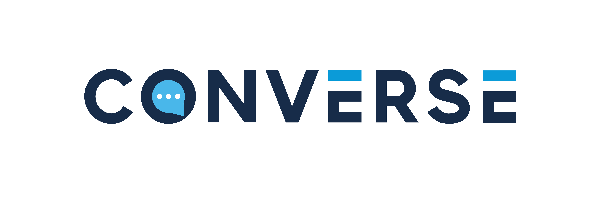
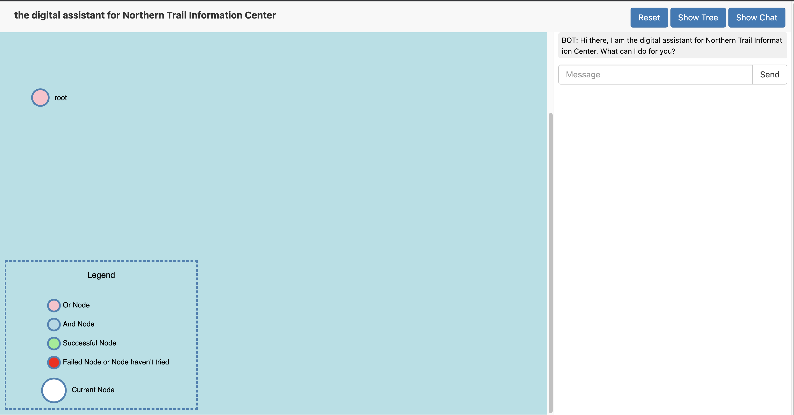
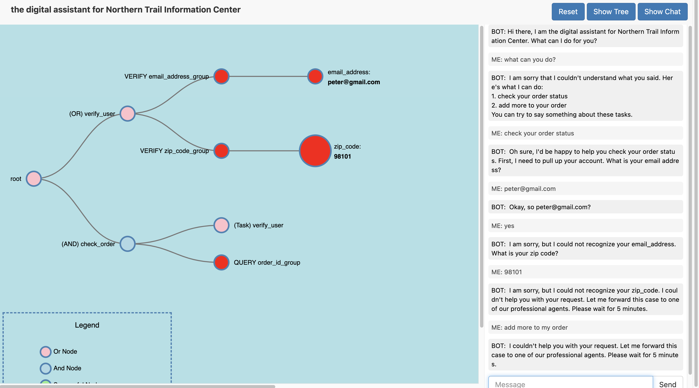

# Converse

Converse is a flexible framework for building and deploying task-oriented chatbots.

## Table of Contents
1. [Getting Started](#getting-started)
2. [Learn more about Converse](#learn-more-about-converse)
3. [How to contribute](#how-to-contribute)
4. [Citing Converse](#citing-converse)

## Getting Started

### Requirements

- python >= 3.7

### Running the Demo - Quick Start

If you don't plan to edit the package code, we recommend using this method of running Converse because it is easier.

1. Install [Docker](https://docs.docker.com/get-docker/).
2. Create a Python 3.7 virtual environment using [Conda](https://docs.conda.io/projects/conda/en/latest/user-guide/install/index.html) and activate it.
3. Run the following command to install the pip package of Converse:
   ```
   pip install converse-sfr==0.0.2
   ```
4. Install `svn` on your computer. On Mac, run:
   ```
   brew install svn
   ```
   If you are using Linux, check [https://subversion.apache.org/packages.html](https://subversion.apache.org/packages.html) to install `subversion`.
   For example, on Ubuntu, run:
   ```
   apt-get install subversion
   apt-get install libapache2-mod-svn
   ```
5. Run `converse-shell` to test if the package is successfully installed.
If the command line output contains `"Hello, Converse!"`, then you installed the package successfully.
6. Run `converse-demo` to interact with pre-built example bots, and follow the instructions in your terminal.
Note that first-time users can leave every required input empty to use the default value.
Open the link provided by the script using your favorite browser, then you should see the demo page (pictured below).
You can interact with the bot by typing in the chat box on the right and the tree visualization will change based on
your task progress. Remember that the example bots are not open-domain chatbots. Please check
[Template Bots](./documentation/Template_bots.md) for the details of the template bots before you run the demo.


7. Run `converse-build` to configure your own bot. Follow the instructions in the terminal to set up the bot.
Note that first-time users can leave every required input empty to use the default value.
Open the link provided by the script using your favorite browser, then you should see the configuration page
(pictured below). To learn more about how to build your own bot, please refer to
[guide for building your first bot](./documentation/Build_your_first_bot.md).


### Running the NLU (NER/Intent/Coreference) services
You can start the NLU services by
```
docker run --name myintent -p 9001:9001 converseallresearch/intent:0.1
docker run --name myner -p 50051:50051 converseallresearch/ner:0.1
```
- Please check out [running NLU services in docker container](Converse/nlu/README_nlu.md)

### Running the Demo After Modifying Files in Converse

1. Clone this repo and `cd` into the `Converse` directory
    ```
    git clone git@github.com:salesforce/Converse.git
    cd Converse
    ```
2. Create a Python 3.7 virtual environment using [Conda](https://docs.conda.io/projects/conda/en/latest/user-guide/install/index.html).
3. Install dependencies. All the necessary packages are listed in `requirements.txt`. You can install all the
   dependencies by running the following command:
    ```
    pip install -r requirements.txt
    ```
4. Add the `Converse` folder to your `PYTHONPATH`.
   ```
   export PYTHONPATH=$PYTHONPATH:/your_directory/Converse
   ```
5. In one terminal window, run the backend and check the log file converse.log:
    ```
    LOGLEVEL=[debug|info|warning|error|critical] python Converse/demo/dial_backend.py
    ```
   You may want to specify custom config files. Supply `--help` option to help you out. The default config files are
   listed in `orchestrator.py` file.
6. In a separate terminal window, run the entity backend services:
    ```
    python Converse/entity_backend/entity_service_backend.py
    ```
7. In a separate terminal window, run the front end and start interacting with the bot!
    ```
    python Converse/demo/client.py
    ```
   You can interact with the bot directly in the command line or in the browser by opening http://localhost:9002/client
   in your favorite browser.  To learn more about how to build your own bot, please refer to
   [guide for building your first bot](./documentation/Build_your_first_bot.md).

## Learn more about Converse

Please refer to the [tutorial on how to build your first bot](./documentation/Build_your_first_bot.md) to get started
by building your first bot.

To learn more about how to customize Converse for your use case, please refer to our documentation for each component of the system:
- [Task Configuration](./documentation/Task_Configuration.md)
- [Entity Configuration](./documentation/Entity.md)
- [Response Configuration](./documentation/Response_Configuration.md)
- [Policy Configuration](./documentation/Policy_config.md)
- [Information Layer Configuration](./documentation/Info_layer_config.md)
- [Template Bots](./documentation/Template_bots.md)

## Ethical Considerations
Chatbot systems can be capable of producing unethical conversations. 
One example is [Microsoft’s Tay which learned and replicated offensive language within hours of interacting with users on Twitter](https://www.sciencedirect.com/science/article/pii/S2515856220300493). 
However, because Converse does not contain a model-based NLG model, this capability is mitigated in our system. 
A bot builder could still provide biased, racist, or otherwise offensive Task Tree, training samples, or FAQs resulting in inappropriate responses, but Converse does not have the ability to learn offensive or racist language from the end-users. 
Likewise, Converse does not have the ability to learn and distribute PII, keeping a user’s information private. 
As with other chatbot systems, there is a potential for dialogue failure. 
To minimizes the risk of user frustration and attrition, bot builders can provide contingency plans for users such as links to a help page, or transference to a human operator.

## How to contribute
Welcome! We are so happy to see you willing to make your contributions to this repository!

You can contribute via pull requests. Please follow these steps:
1. Create an issue describing the feature you want to add or modify. A maintainer will review your issue.
2. Discuss the issue with the maintainer in the issue you created.
3. Write your code, tests and documentation, and format them with `black`. We provide a `run_black.sh` script to help you format your code.
4. Run `./run_unittest.sh`. Make sure that no error occurs in the tests.
5. Create a pull request (PR) describing your changes. Note that your PR should be a reasonable length (<= 500 lines).

Your PR will be reviewed by a maintainer. When you get the approval from the maintainer, you can merge your code into the
main branch.


### Citing Converse
You can find more details in our paper: https://arxiv.org/abs/2203.12187

If you're using Converse in your research or applications, please cite using this BibTeX:
```
@misc{https://doi.org/10.48550/arxiv.2203.12187,
  doi = {10.48550/ARXIV.2203.12187},
  url = {https://arxiv.org/abs/2203.12187},
  author = {Xie, Tian and Yang, Xinyi and Lin, Angela S. and Wu, Feihong and Hashimoto, Kazuma and Qu, Jin and Kang, Young Mo and Yin, Wenpeng and Wang, Huan and Yavuz, Semih and Wu, Gang and Jones, Michael and Socher, Richard and Zhou, Yingbo and Liu, Wenhao and Xiong, Caiming},
  keywords = {Computation and Language (cs.CL), Artificial Intelligence (cs.AI), FOS: Computer and information sciences, FOS: Computer and information sciences},
  title = {Converse: A Tree-Based Modular Task-Oriented Dialogue System},
  publisher = {arXiv},
  year = {2022},
  copyright = {Creative Commons Attribution 4.0 International}
}

```
